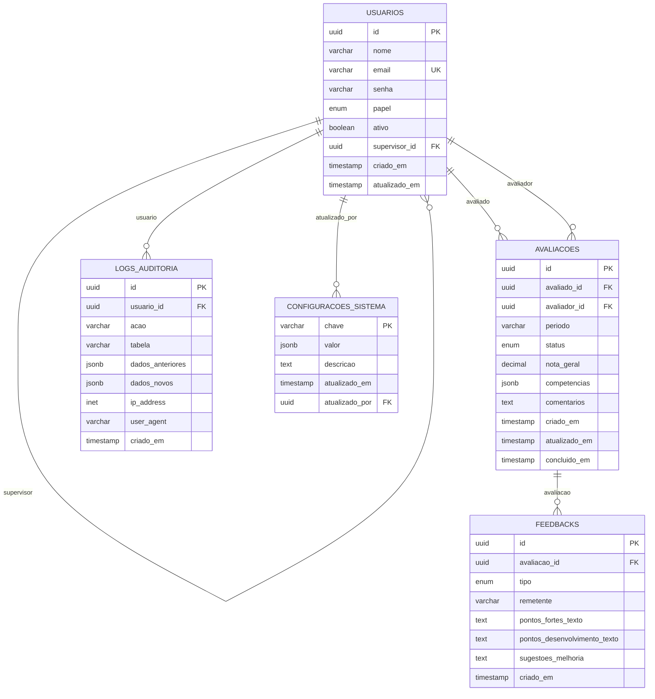

# Documentação do Banco de Dados - Koerner 360

## Índice

1. [Visão Geral](#visão-geral)
2. [Arquitetura](#arquitetura)
3. [Modelos de Dados](#modelos-de-dados)
4. [Relacionamentos](#relacionamentos)
5. [Enumerações](#enumerações)
6. [Configuração](#configuração)
7. [Segurança](#segurança)
8. [Performance](#performance)
9. [Migrações](#migrações)
10. [Troubleshooting](#troubleshooting)

## Visão Geral

O sistema Koerner 360 utiliza PostgreSQL como banco de dados principal, gerenciado através do Prisma ORM. Esta arquitetura fornece type-safety, migrações automáticas e uma interface intuitiva para desenvolvimento.

### Tecnologias

- **ORM**: Prisma v6.14.0
- **Banco de Dados**: PostgreSQL
- **Migrações**: Prisma Migrate
- **Cliente**: @prisma/client
- **Seed**: TypeScript com tsx

## Arquitetura

### Características

- **SGBD**: PostgreSQL 15+
- **ORM**: Prisma com type-safety
- **Encoding**: UTF-8
- **Timezone**: UTC
- **Connection Pooling**: Habilitado
- **Migrações**: Versionadas e automáticas

## Esquema do Banco

### Diagrama ER



## Tabelas

### usuarios

Armazena informações dos usuários do sistema.

```sql
CREATE TABLE usuarios (
    id UUID PRIMARY KEY DEFAULT gen_random_uuid(),
    nome VARCHAR(255) NOT NULL,
    email VARCHAR(255) UNIQUE NOT NULL,
    senha VARCHAR(255) NOT NULL, -- Hash bcrypt
    papel VARCHAR(20) NOT NULL CHECK (papel IN ('admin', 'supervisor', 'attendant')),
    ativo BOOLEAN DEFAULT true,
    supervisor_id UUID REFERENCES usuarios(id),
    criado_em TIMESTAMP WITH TIME ZONE DEFAULT NOW(),
    atualizado_em TIMESTAMP WITH TIME ZONE DEFAULT NOW(),
    
    -- Constraints
    CONSTRAINT email_valido CHECK (email ~* '^[A-Za-z0-9._%+-]+@[A-Za-z0-9.-]+\.[A-Za-z]{2,}$'),
    CONSTRAINT nome_nao_vazio CHECK (LENGTH(TRIM(nome)) > 0),
    CONSTRAINT supervisor_hierarquia CHECK (
        (papel = 'attendant' AND supervisor_id IS NOT NULL) OR
        (papel IN ('admin', 'supervisor') AND supervisor_id IS NULL)
    )
);

-- Índices
CREATE INDEX idx_usuarios_email ON usuarios(email);
CREATE INDEX idx_usuarios_papel ON usuarios(papel);
CREATE INDEX idx_usuarios_supervisor ON usuarios(supervisor_id);
CREATE INDEX idx_usuarios_ativo ON usuarios(ativo);

-- Trigger para atualizar timestamp
CREATE OR REPLACE FUNCTION atualizar_timestamp()
RETURNS TRIGGER AS $$
BEGIN
    NEW.atualizado_em = NOW();
    RETURN NEW;
END;
$$ LANGUAGE plpgsql;

CREATE TRIGGER trigger_usuarios_atualizado_em
    BEFORE UPDATE ON usuarios
    FOR EACH ROW
    EXECUTE FUNCTION atualizar_timestamp();
```

### avaliacoes

Armazena as avaliações de desempenho.

```sql
CREATE TABLE avaliacoes (
    id UUID PRIMARY KEY DEFAULT gen_random_uuid(),
    avaliado_id UUID NOT NULL REFERENCES usuarios(id) ON DELETE CASCADE,
    avaliador_id UUID NOT NULL REFERENCES usuarios(id) ON DELETE CASCADE,
    periodo VARCHAR(20) NOT NULL, -- Ex: "2024-Q1", "2024-01"
    status VARCHAR(20) DEFAULT 'pendente' CHECK (status IN ('pendente', 'em_andamento', 'concluida')),
    nota_geral DECIMAL(3,2) CHECK (nota_geral >= 1.0 AND nota_geral <= 5.0),
    competencias JSONB NOT NULL DEFAULT '{}',
    comentarios TEXT,
    criado_em TIMESTAMP WITH TIME ZONE DEFAULT NOW(),
    atualizado_em TIMESTAMP WITH TIME ZONE DEFAULT NOW(),
    concluido_em TIMESTAMP WITH TIME ZONE,
    
    -- Constraints
    CONSTRAINT avaliacao_unica_periodo UNIQUE (avaliado_id, avaliador_id, periodo),
    CONSTRAINT competencias_validas CHECK (
        competencias ? 'comunicacao' AND
        competencias ? 'trabalho_em_equipe' AND
        competencias ? 'lideranca' AND
        competencias ? 'resolucao_problemas' AND
        competencias ? 'pontualidade'
    ),
    CONSTRAINT status_concluido CHECK (
        (status = 'concluida' AND concluido_em IS NOT NULL AND nota_geral IS NOT NULL) OR
        (status != 'concluida' AND concluido_em IS NULL)
    )
);

-- Índices
CREATE INDEX idx_avaliacoes_avaliado ON avaliacoes(avaliado_id);
CREATE INDEX idx_avaliacoes_avaliador ON avaliacoes(avaliador_id);
CREATE INDEX idx_avaliacoes_periodo ON avaliacoes(periodo);
CREATE INDEX idx_avaliacoes_status ON avaliacoes(status);
CREATE INDEX idx_avaliacoes_competencias ON avaliacoes USING GIN (competencias);

-- Trigger para atualizar timestamp
CREATE TRIGGER trigger_avaliacoes_atualizado_em
    BEFORE UPDATE ON avaliacoes
    FOR EACH ROW
    EXECUTE FUNCTION atualizar_timestamp();

-- Trigger para definir data de conclusão
CREATE OR REPLACE FUNCTION definir_data_conclusao()
RETURNS TRIGGER AS $$
BEGIN
    IF NEW.status = 'concluida' AND OLD.status != 'concluida' THEN
        NEW.concluido_em = NOW();
    ELSIF NEW.status != 'concluida' THEN
        NEW.concluido_em = NULL;
    END IF;
    RETURN NEW;
END;
$$ LANGUAGE plpgsql;

CREATE TRIGGER trigger_avaliacoes_conclusao
    BEFORE UPDATE ON avaliacoes
    FOR EACH ROW
    EXECUTE FUNCTION definir_data_conclusao();
```

### feedbacks

Armazena feedbacks detalhados das avaliações.

```sql
CREATE TABLE feedbacks (
    id UUID PRIMARY KEY DEFAULT gen_random_uuid(),
    avaliacao_id UUID NOT NULL REFERENCES avaliacoes(id) ON DELETE CASCADE,
    tipo VARCHAR(20) NOT NULL CHECK (tipo IN ('autoavaliacao', 'supervisor', 'par', 'subordinado')),
    remetente VARCHAR(255) NOT NULL,
    pontos_fortes_texto TEXT,
    pontos_desenvolvimento_texto TEXT,
    sugestoes_melhoria TEXT,
    criado_em TIMESTAMP WITH TIME ZONE DEFAULT NOW(),
    
    -- Constraints
    CONSTRAINT feedback_nao_vazio CHECK (
        LENGTH(TRIM(COALESCE(pontos_fortes_texto, ''))) > 0 OR
        LENGTH(TRIM(COALESCE(pontos_desenvolvimento_texto, ''))) > 0 OR
        LENGTH(TRIM(COALESCE(sugestoes_melhoria, ''))) > 0
    )
);

-- Índices
CREATE INDEX idx_feedbacks_avaliacao ON feedbacks(avaliacao_id);
CREATE INDEX idx_feedbacks_tipo ON feedbacks(tipo);
CREATE INDEX idx_feedbacks_criado_em ON feedbacks(criado_em);
```

### logs_auditoria

Registra todas as ações importantes do sistema para auditoria.

```sql
CREATE TABLE logs_auditoria (
    id UUID PRIMARY KEY DEFAULT gen_random_uuid(),
    usuario_id UUID REFERENCES usuarios(id),
    acao VARCHAR(50) NOT NULL, -- INSERT, UPDATE, DELETE, LOGIN, LOGOUT
    tabela VARCHAR(50), -- Nome da tabela afetada
    registro_id UUID, -- ID do registro afetado
    dados_anteriores JSONB, -- Estado anterior (para UPDATE/DELETE)
    dados_novos JSONB, -- Estado novo (para INSERT/UPDATE)
    ip_address INET,
    user_agent TEXT,
    criado_em TIMESTAMP WITH TIME ZONE DEFAULT NOW()
);

-- Índices
CREATE INDEX idx_logs_usuario ON logs_auditoria(usuario_id);
CREATE INDEX idx_logs_acao ON logs_auditoria(acao);
CREATE INDEX idx_logs_tabela ON logs_auditoria(tabela);
CREATE INDEX idx_logs_criado_em ON logs_auditoria(criado_em);
CREATE INDEX idx_logs_ip ON logs_auditoria(ip_address);
```

### configuracoes_sistema

Armazena configurações globais do sistema.

```sql
CREATE TABLE configuracoes_sistema (
    chave VARCHAR(100) PRIMARY KEY,
    valor JSONB NOT NULL,
    descricao TEXT,
    atualizado_em TIMESTAMP WITH TIME ZONE DEFAULT NOW(),
    atualizado_por UUID REFERENCES usuarios(id)
);

-- Trigger para atualizar timestamp
CREATE TRIGGER trigger_configuracoes_atualizado_em
    BEFORE UPDATE ON configuracoes_sistema
    FOR EACH ROW
    EXECUTE FUNCTION atualizar_timestamp();

-- Inserir configurações padrão
INSERT INTO configuracoes_sistema (chave, valor, descricao) VALUES
('sistema.nome', '"Koerner 360"', 'Nome do sistema'),
('sistema.versao', '"1.0.0"', 'Versão atual do sistema'),
('avaliacoes.escala_minima', '1', 'Nota mínima para avaliações'),
('avaliacoes.escala_maxima', '5', 'Nota máxima para avaliações'),
('avaliacoes.periodos_ativos', '["2024-Q1", "2024-Q2"]', 'Períodos de avaliação ativos'),
('notificacoes.email_habilitado', 'true', 'Habilitar notificações por email'),
('sistema.manutencao', 'false', 'Sistema em manutenção');
```

## Relacionamentos

### Hierarquia de Usuários

```sql
-- View para visualizar hierarquia
CREATE VIEW hierarquia_usuarios AS
WITH RECURSIVE hierarquia AS (
    -- Nível raiz (admins e supervisores sem supervisor)
    SELECT 
        id,
        nome,
        email,
        papel,
        supervisor_id,
        0 as nivel,
        ARRAY[nome] as caminho
    FROM usuarios 
    WHERE supervisor_id IS NULL AND ativo = true
    
    UNION ALL
    
    -- Níveis subsequentes
    SELECT 
        u.id,
        u.nome,
        u.email,
        u.papel,
        u.supervisor_id,
        h.nivel + 1,
        h.caminho || u.nome
    FROM usuarios u
    INNER JOIN hierarquia h ON u.supervisor_id = h.id
    WHERE u.ativo = true
)
SELECT * FROM hierarquia
ORDER BY nivel, nome;
```

### Estatísticas de Avaliações

```sql
-- View para estatísticas de avaliações
CREATE VIEW estatisticas_avaliacoes AS
SELECT 
    u.id as usuario_id,
    u.nome,
    u.papel,
    COUNT(a.id) as total_avaliacoes,
    COUNT(CASE WHEN a.status = 'concluida' THEN 1 END) as avaliacoes_concluidas,
    COUNT(CASE WHEN a.status = 'pendente' THEN 1 END) as avaliacoes_pendentes,
    ROUND(AVG(CASE WHEN a.status = 'concluida' THEN a.nota_geral END), 2) as media_geral,
    MAX(a.concluido_em) as ultima_avaliacao
FROM usuarios u
LEFT JOIN avaliacoes a ON u.id = a.avaliado_id
WHERE u.ativo = true
GROUP BY u.id, u.nome, u.papel
ORDER BY u.nome;
```

## Índices

### Índices de Performance

```sql
-- Índice composto para consultas de avaliações por período e status
CREATE INDEX idx_avaliacoes_periodo_status ON avaliacoes(periodo, status);

-- Índice para busca de texto em comentários
CREATE INDEX idx_avaliacoes_comentarios_texto ON avaliacoes USING GIN (to_tsvector('portuguese', comentarios));

-- Índice para busca de texto em feedbacks
CREATE INDEX idx_feedbacks_texto ON feedbacks USING GIN (
    to_tsvector('portuguese', 
        COALESCE(pontos_fortes_texto, '') || ' ' ||
        COALESCE(pontos_desenvolvimento_texto, '') || ' ' ||
        COALESCE(sugestoes_melhoria, '')
    )
);

-- Índice para consultas de auditoria por data
CREATE INDEX idx_logs_auditoria_data ON logs_auditoria(criado_em DESC);
```

## Triggers

### Trigger de Auditoria

```sql
-- Função para auditoria automática
CREATE OR REPLACE FUNCTION auditoria_automatica()
RETURNS TRIGGER AS $$
DECLARE
    usuario_atual UUID;
BEGIN
    -- Tentar obter o usuário atual da sessão
    BEGIN
        usuario_atual := current_setting('app.current_user_id')::UUID;
    EXCEPTION
        WHEN OTHERS THEN
            usuario_atual := NULL;
    END;
    
    IF TG_OP = 'DELETE' THEN
        INSERT INTO logs_auditoria (
            usuario_id, acao, tabela, registro_id, dados_anteriores
        ) VALUES (
            usuario_atual, 'DELETE', TG_TABLE_NAME, OLD.id, to_jsonb(OLD)
        );
        RETURN OLD;
    ELSIF TG_OP = 'UPDATE' THEN
        INSERT INTO logs_auditoria (
            usuario_id, acao, tabela, registro_id, dados_anteriores, dados_novos
        ) VALUES (
            usuario_atual, 'UPDATE', TG_TABLE_NAME, NEW.id, to_jsonb(OLD), to_jsonb(NEW)
        );
        RETURN NEW;
    ELSIF TG_OP = 'INSERT' THEN
        INSERT INTO logs_auditoria (
            usuario_id, acao, tabela, registro_id, dados_novos
        ) VALUES (
            usuario_atual, 'INSERT', TG_TABLE_NAME, NEW.id, to_jsonb(NEW)
        );
        RETURN NEW;
    END IF;
    RETURN NULL;
END;
$$ LANGUAGE plpgsql;

-- Aplicar trigger de auditoria nas tabelas principais
CREATE TRIGGER trigger_auditoria_usuarios
    AFTER INSERT OR UPDATE OR DELETE ON usuarios
    FOR EACH ROW EXECUTE FUNCTION auditoria_automatica();

CREATE TRIGGER trigger_auditoria_avaliacoes
    AFTER INSERT OR UPDATE OR DELETE ON avaliacoes
    FOR EACH ROW EXECUTE FUNCTION auditoria_automatica();

CREATE TRIGGER trigger_auditoria_feedbacks
    AFTER INSERT OR UPDATE OR DELETE ON feedbacks
    FOR EACH ROW EXECUTE FUNCTION auditoria_automatica();
```

### Trigger de Validação

```sql
-- Validar competências nas avaliações
CREATE OR REPLACE FUNCTION validar_competencias()
RETURNS TRIGGER AS $$
BEGIN
    -- Verificar se todas as competências têm valores válidos
    IF NEW.competencias IS NOT NULL THEN
        DECLARE
            competencia TEXT;
            valor NUMERIC;
        BEGIN
            FOR competencia IN SELECT jsonb_object_keys(NEW.competencias) LOOP
                valor := (NEW.competencias ->> competencia)::NUMERIC;
                IF valor < 1 OR valor > 5 THEN
                    RAISE EXCEPTION 'Competência % deve ter valor entre 1 e 5, recebido: %', competencia, valor;
                END IF;
            END LOOP;
        END;
    END IF;
    
    RETURN NEW;
END;
$$ LANGUAGE plpgsql;

CREATE TRIGGER trigger_validar_competencias
    BEFORE INSERT OR UPDATE ON avaliacoes
    FOR EACH ROW EXECUTE FUNCTION validar_competencias();
```

## Views

### Dashboard de Métricas

```sql
-- View para métricas do dashboard
CREATE VIEW dashboard_metricas AS
SELECT 
    'usuarios_total' as metrica,
    COUNT(*)::TEXT as valor
FROM usuarios WHERE ativo = true

UNION ALL

SELECT 
    'avaliacoes_pendentes' as metrica,
    COUNT(*)::TEXT as valor
FROM avaliacoes WHERE status = 'pendente'

UNION ALL

SELECT 
    'avaliacoes_concluidas' as metrica,
    COUNT(*)::TEXT as valor
FROM avaliacoes WHERE status = 'concluida'

UNION ALL

SELECT 
    'media_geral' as metrica,
    ROUND(AVG(nota_geral), 2)::TEXT as valor
FROM avaliacoes WHERE status = 'concluida' AND nota_geral IS NOT NULL;
```

### Relatório de Performance

```sql
-- View para relatório de performance por período
CREATE VIEW relatorio_performance AS
SELECT 
    a.periodo,
    u.nome as avaliado,
    u.papel,
    s.nome as supervisor,
    COUNT(a.id) as total_avaliacoes,
    ROUND(AVG(a.nota_geral), 2) as media_geral,
    ROUND(AVG((a.competencias->>'comunicacao')::NUMERIC), 2) as media_comunicacao,
    ROUND(AVG((a.competencias->>'trabalho_em_equipe')::NUMERIC), 2) as media_trabalho_equipe,
    ROUND(AVG((a.competencias->>'lideranca')::NUMERIC), 2) as media_lideranca,
    ROUND(AVG((a.competencias->>'resolucao_problemas')::NUMERIC), 2) as media_resolucao_problemas,
    ROUND(AVG((a.competencias->>'pontualidade')::NUMERIC), 2) as media_pontualidade
FROM avaliacoes a
JOIN usuarios u ON a.avaliado_id = u.id
LEFT JOIN usuarios s ON u.supervisor_id = s.id
WHERE a.status = 'concluida'
GROUP BY a.periodo, u.id, u.nome, u.papel, s.nome
ORDER BY a.periodo DESC, u.nome;
```

## Políticas de Segurança (RLS)

### Row Level Security

```sql
-- Habilitar RLS nas tabelas
ALTER TABLE usuarios ENABLE ROW LEVEL SECURITY;
ALTER TABLE avaliacoes ENABLE ROW LEVEL SECURITY;
ALTER TABLE feedbacks ENABLE ROW LEVEL SECURITY;
ALTER TABLE logs_auditoria ENABLE ROW LEVEL SECURITY;

-- Política para usuários
CREATE POLICY politica_usuarios_admin ON usuarios
    FOR ALL USING (
        EXISTS (
            SELECT 1 FROM usuarios u 
            WHERE u.id = current_setting('app.current_user_id')::UUID 
            AND u.papel = 'admin'
        )
    );

CREATE POLICY politica_usuarios_supervisor ON usuarios
    FOR SELECT USING (
        EXISTS (
            SELECT 1 FROM usuarios u 
            WHERE u.id = current_setting('app.current_user_id')::UUID 
            AND u.papel = 'supervisor'
            AND (usuarios.supervisor_id = u.id OR usuarios.id = u.id)
        )
    );

CREATE POLICY politica_usuarios_proprio ON usuarios
    FOR SELECT USING (
        id = current_setting('app.current_user_id')::UUID
    );

-- Política para avaliações
CREATE POLICY politica_avaliacoes_admin ON avaliacoes
    FOR ALL USING (
        EXISTS (
            SELECT 1 FROM usuarios u 
            WHERE u.id = current_setting('app.current_user_id')::UUID 
            AND u.papel = 'admin'
        )
    );

CREATE POLICY politica_avaliacoes_supervisor ON avaliacoes
    FOR ALL USING (
        EXISTS (
            SELECT 1 FROM usuarios u 
            WHERE u.id = current_setting('app.current_user_id')::UUID 
            AND u.papel = 'supervisor'
            AND (avaliacoes.avaliado_id IN (
                SELECT id FROM usuarios WHERE supervisor_id = u.id
            ) OR avaliacoes.avaliador_id = u.id)
        )
    );

CREATE POLICY politica_avaliacoes_attendant ON avaliacoes
    FOR SELECT USING (
        avaliado_id = current_setting('app.current_user_id')::UUID OR
        avaliador_id = current_setting('app.current_user_id')::UUID
    );
```

## Migrações

### Script de Migração Inicial

```sql
-- Migration: 001_initial_schema.sql
-- Criação do esquema inicial do banco de dados

BEGIN;

-- Extensões necessárias
CREATE EXTENSION IF NOT EXISTS "uuid-ossp";
CREATE EXTENSION IF NOT EXISTS "pg_trgm";
CREATE EXTENSION IF NOT EXISTS "unaccent";

-- Criar tabelas (código das tabelas aqui)

-- Inserir dados iniciais
INSERT INTO usuarios (nome, email, senha, papel) VALUES
('Administrador', 'admin@koerner360.com', '$2b$10$hash_da_senha_admin', 'admin'),
('Supervisor Teste', 'supervisor@koerner360.com', '$2b$10$hash_da_senha_supervisor', 'supervisor'),
('Atendente Teste', 'atendente@koerner360.com', '$2b$10$hash_da_senha_atendente', 'attendant');

-- Atualizar supervisor do atendente
UPDATE usuarios 
SET supervisor_id = (SELECT id FROM usuarios WHERE email = 'supervisor@koerner360.com')
WHERE email = 'atendente@koerner360.com';

COMMIT;
```

### Versionamento de Migrações

```sql
-- Tabela para controle de migrações
CREATE TABLE IF NOT EXISTS schema_migrations (
    version VARCHAR(255) PRIMARY KEY,
    applied_at TIMESTAMP WITH TIME ZONE DEFAULT NOW()
);

-- Registrar migração inicial
INSERT INTO schema_migrations (version) VALUES ('001_initial_schema');
```

## Backup e Restore

### Script de Backup

```bash
#!/bin/bash
# backup.sh

DATE=$(date +"%Y%m%d_%H%M%S")
BACKUP_DIR="/backups/koerner360"
DB_NAME="koerner360"
DB_USER="postgres"
DB_HOST="localhost"

# Criar diretório se não existir
mkdir -p $BACKUP_DIR

# Backup completo
pg_dump -h $DB_HOST -U $DB_USER -d $DB_NAME -f "$BACKUP_DIR/full_backup_$DATE.sql"

# Backup apenas dos dados
pg_dump -h $DB_HOST -U $DB_USER -d $DB_NAME --data-only -f "$BACKUP_DIR/data_backup_$DATE.sql"

# Backup apenas do esquema
pg_dump -h $DB_HOST -U $DB_USER -d $DB_NAME --schema-only -f "$BACKUP_DIR/schema_backup_$DATE.sql"

# Compactar backups
gzip "$BACKUP_DIR/full_backup_$DATE.sql"
gzip "$BACKUP_DIR/data_backup_$DATE.sql"
gzip "$BACKUP_DIR/schema_backup_$DATE.sql"

# Remover backups antigos (manter últimos 30 dias)
find $BACKUP_DIR -name "*.gz" -mtime +30 -delete

echo "Backup concluído: $DATE"
```

### Script de Restore

```bash
#!/bin/bash
# restore.sh

if [ $# -eq 0 ]; then
    echo "Uso: $0 <arquivo_backup>"
    exit 1
fi

BACKUP_FILE=$1
DB_NAME="koerner360"
DB_USER="postgres"
DB_HOST="localhost"

# Verificar se o arquivo existe
if [ ! -f "$BACKUP_FILE" ]; then
    echo "Arquivo não encontrado: $BACKUP_FILE"
    exit 1
fi

# Descompactar se necessário
if [[ $BACKUP_FILE == *.gz ]]; then
    gunzip -c "$BACKUP_FILE" | psql -h $DB_HOST -U $DB_USER -d $DB_NAME
else
    psql -h $DB_HOST -U $DB_USER -d $DB_NAME -f "$BACKUP_FILE"
fi

echo "Restore concluído"
```

### Monitoramento de Performance

```sql
-- View para monitorar queries lentas
CREATE VIEW queries_lentas AS
SELECT 
    query,
    calls,
    total_time,
    mean_time,
    rows,
    100.0 * shared_blks_hit / nullif(shared_blks_hit + shared_blks_read, 0) AS hit_percent
FROM pg_stat_statements 
ORDER BY total_time DESC
LIMIT 20;

-- View para monitorar tamanho das tabelas
CREATE VIEW tamanho_tabelas AS
SELECT 
    schemaname,
    tablename,
    attname,
    n_distinct,
    correlation,
    pg_size_pretty(pg_total_relation_size(schemaname||'.'||tablename)) as tamanho
FROM pg_stats 
WHERE schemaname = 'public'
ORDER BY pg_total_relation_size(schemaname||'.'||tablename) DESC;
```

---

**Última atualização**: Janeiro 2024
**Versão do Schema**: 1.0.0