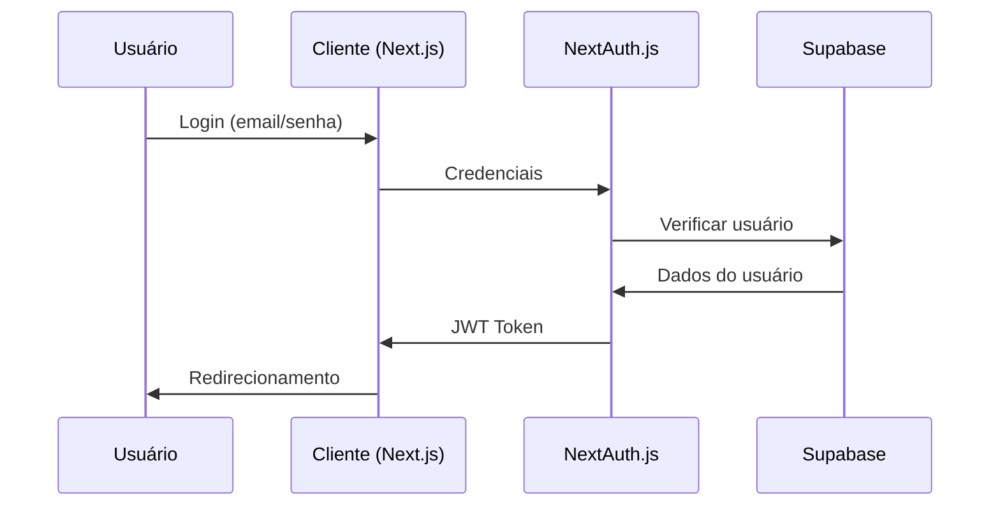

# Guia de Desenvolvimento - Koerner 360

## Índice

1. [Visão Geral](#visão-geral)
2. [Arquitetura do Sistema](#arquitetura-do-sistema)
3. [Configuração do Ambiente](#configuração-do-ambiente)
4. [Estrutura do Projeto](#estrutura-do-projeto)
5. [Padrões de Código](#padrões-de-código)
6. [Fluxo de Desenvolvimento](#fluxo-de-desenvolvimento)
7. [Testes](#testes)
8. [Deploy](#deploy)
9. [Troubleshooting](#troubleshooting)

## Visão Geral

O Koerner 360 é um sistema de gestão de feedback e avaliações construído com tecnologias modernas, focando em performance, segurança e experiência do usuário.

### Tecnologias Principais

- **Frontend**: Next.js 15 com App Router
- **Linguagem**: TypeScript
- **Autenticação**: NextAuth.js v5
- **Banco de Dados**: PostgreSQL via Supabase
- **Estilização**: Tailwind CSS
- **Componentes**: shadcn/ui
- **Formulários**: React Hook Form + Zod
- **Gráficos**: Recharts

## Arquitetura do Sistema

### Estrutura de Camadas

```
┌─────────────────────────────────────┐
│           Presentation Layer        │
│     (Next.js Pages & Components)    │
├─────────────────────────────────────┤
│           Business Logic            │
│        (Custom Hooks & Utils)      │
├─────────────────────────────────────┤
│           Data Access Layer        │
│         (Supabase Client)          │
├─────────────────────────────────────┤
│             Database               │
│          (PostgreSQL)              │
└─────────────────────────────────────┘
```

### Fluxo de Autenticação



## Configuração do Ambiente

### Pré-requisitos

- Node.js 18.17.0 ou superior
- npm 9.0.0 ou superior
- Git
- Conta no Supabase

### Variáveis de Ambiente

Crie um arquivo `.env.local` na raiz do projeto:

```env
# NextAuth.js
NEXTAUTH_SECRET=seu_secret_super_seguro_aqui
NEXTAUTH_URL=http://localhost:3000

# Supabase
NEXT_PUBLIC_SUPABASE_URL=sua_url_do_supabase
NEXT_PUBLIC_SUPABASE_ANON_KEY=sua_chave_anonima_do_supabase
SUPABASE_SERVICE_ROLE_KEY=sua_chave_de_servico_do_supabase
DATABASE_URL=sua_connection_string_do_postgres
```

### Instalação

```bash
# Clone o repositório
git clone https://github.com/seu-usuario/koerner360.git
cd koerner360

# Instale as dependências
npm install

# Configure o banco de dados
npm run db:setup

# Inicie o servidor de desenvolvimento
npm run dev
```

## Estrutura do Projeto

```
koerner360/
├── src/
│   ├── app/                    # App Router (Next.js 13+)
│   │   ├── api/               # API Routes
│   │   ├── dashboard/         # Páginas do dashboard
│   │   ├── login/            # Página de login
│   │   ├── globals.css       # Estilos globais
│   │   ├── layout.tsx        # Layout raiz
│   │   └── page.tsx          # Página inicial
│   ├── components/           # Componentes React
│   │   ├── ui/              # Componentes shadcn/ui
│   │   ├── layout/          # Componentes de layout
│   │   └── providers/       # Context providers
│   ├── lib/                 # Utilitários e configurações
│   │   ├── auth.ts         # Configuração NextAuth.js
│   │   ├── supabase.ts     # Cliente Supabase
│   │   └── utils.ts        # Funções utilitárias
│   ├── types/              # Definições de tipos TypeScript
│   └── hooks/              # Custom hooks
├── docs/                   # Documentação
├── public/                # Arquivos estáticos
├── .env.local            # Variáveis de ambiente (local)
├── .gitignore           # Arquivos ignorados pelo Git
├── package.json         # Dependências e scripts
├── tailwind.config.js   # Configuração Tailwind
├── tsconfig.json       # Configuração TypeScript
└── next.config.js      # Configuração Next.js
```

## Padrões de Código

### Nomenclatura

#### Arquivos e Diretórios
- **Componentes**: PascalCase (`UserProfile.tsx`)
- **Páginas**: kebab-case (`user-profile/page.tsx`)
- **Utilitários**: camelCase (`formatDate.ts`)
- **Tipos**: PascalCase (`UserTypes.ts`)

#### Variáveis e Funções
- **Variáveis**: camelCase (`nomeUsuario`)
- **Funções**: camelCase (`obterDadosUsuario`)
- **Constantes**: UPPER_SNAKE_CASE (`API_BASE_URL`)
- **Componentes**: PascalCase (`PerfilUsuario`)

### Estrutura de Componentes

```typescript
// Exemplo de componente bem estruturado
import { useState, useEffect } from 'react';
import { Button } from '@/components/ui/button';
import { Card } from '@/components/ui/card';

interface PerfilUsuarioProps {
  usuarioId: string;
  onAtualizar?: () => void;
}

export function PerfilUsuario({ usuarioId, onAtualizar }: PerfilUsuarioProps) {
  const [carregando, setCarregando] = useState(false);
  const [dados, setDados] = useState(null);

  useEffect(() => {
    // Lógica de carregamento
  }, [usuarioId]);

  const handleSalvar = async () => {
    // Lógica de salvamento
  };

  if (carregando) {
    return <div>Carregando...</div>;
  }

  return (
    <Card>
      {/* Conteúdo do componente */}
      <Button onClick={handleSalvar}>
        Salvar
      </Button>
    </Card>
  );
}
```

### Hooks Customizados

```typescript
// hooks/useUsuario.ts
import { useState, useEffect } from 'react';
import { supabase } from '@/lib/supabase';

export function useUsuario(usuarioId: string) {
  const [usuario, setUsuario] = useState(null);
  const [carregando, setCarregando] = useState(true);
  const [erro, setErro] = useState(null);

  useEffect(() => {
    async function buscarUsuario() {
      try {
        setCarregando(true);
        const { data, error } = await supabase
          .from('usuarios')
          .select('*')
          .eq('id', usuarioId)
          .single();

        if (error) throw error;
        setUsuario(data);
      } catch (error) {
        setErro(error.message);
      } finally {
        setCarregando(false);
      }
    }

    if (usuarioId) {
      buscarUsuario();
    }
  }, [usuarioId]);

  return { usuario, carregando, erro };
}
```

### Validação com Zod

```typescript
// lib/schemas.ts
import { z } from 'zod';

export const esquemaLogin = z.object({
  email: z
    .string()
    .email('Email inválido')
    .min(1, 'Email é obrigatório'),
  senha: z
    .string()
    .min(6, 'Senha deve ter pelo menos 6 caracteres')
    .min(1, 'Senha é obrigatória'),
});

export type DadosLogin = z.infer<typeof esquemaLogin>;
```

## Fluxo de Desenvolvimento

### Git Workflow

1. **Criar branch**: `git checkout -b feature/nova-funcionalidade`
2. **Desenvolver**: Implementar a funcionalidade
3. **Testar**: Executar testes localmente
4. **Commit**: `git commit -m "feat: adicionar nova funcionalidade"`
5. **Push**: `git push origin feature/nova-funcionalidade`
6. **Pull Request**: Criar PR para review
7. **Merge**: Após aprovação, fazer merge

### Convenções de Commit

```
feat: nova funcionalidade
fix: correção de bug
docs: atualização de documentação
style: formatação, ponto e vírgula, etc
refactor: refatoração de código
test: adição ou correção de testes
chore: tarefas de manutenção
```

### Code Review Checklist

- [ ] Código segue os padrões estabelecidos
- [ ] Funcionalidade está testada
- [ ] Documentação foi atualizada
- [ ] Não há vazamentos de memória
- [ ] Performance está adequada
- [ ] Acessibilidade foi considerada
- [ ] Responsividade foi testada

## Testes

### Estrutura de Testes

```
__tests__/
├── components/          # Testes de componentes
├── pages/              # Testes de páginas
├── utils/              # Testes de utilitários
└── integration/        # Testes de integração
```

### Exemplo de Teste de Componente

```typescript
// __tests__/components/PerfilUsuario.test.tsx
import { render, screen } from '@testing-library/react';
import { PerfilUsuario } from '@/components/PerfilUsuario';

describe('PerfilUsuario', () => {
  it('deve renderizar o nome do usuário', () => {
    render(<PerfilUsuario usuarioId="123" />);
    
    expect(screen.getByText('João Silva')).toBeInTheDocument();
  });

  it('deve mostrar loading inicialmente', () => {
    render(<PerfilUsuario usuarioId="123" />);
    
    expect(screen.getByText('Carregando...')).toBeInTheDocument();
  });
});
```

### Scripts de Teste

```bash
# Executar todos os testes
npm test

# Executar testes em modo watch
npm run test:watch

# Executar testes com coverage
npm run test:coverage

# Executar testes e2e
npm run test:e2e
```

## Deploy

### Vercel (Recomendado)

1. Conecte o repositório ao Vercel
2. Configure as variáveis de ambiente
3. Deploy automático a cada push na main

### Variáveis de Ambiente (Produção)

```env
NEXTAUTH_SECRET=secret_super_seguro_producao
NEXTAUTH_URL=https://seu-dominio.com
NEXT_PUBLIC_SUPABASE_URL=url_supabase_producao
NEXT_PUBLIC_SUPABASE_ANON_KEY=chave_anonima_producao
SUPABASE_SERVICE_ROLE_KEY=chave_servico_producao
DATABASE_URL=connection_string_producao
```

### Build Local

```bash
# Build para produção
npm run build

# Testar build localmente
npm start

# Analisar bundle
npm run analyze
```

## Troubleshooting

### Problemas Comuns

#### Erro de Autenticação
```
Error: NextAuth.js configuration error
```
**Solução**: Verificar se `NEXTAUTH_SECRET` está configurado

#### Erro de Conexão com Supabase
```
Error: Invalid API key
```
**Solução**: Verificar se as chaves do Supabase estão corretas

#### Erro de Build
```
Type error: Property 'role' does not exist
```
**Solução**: Verificar se os tipos do NextAuth foram estendidos corretamente

### Debug

#### Logs do NextAuth
```typescript
// lib/auth.ts
export const authOptions: NextAuthOptions = {
  debug: process.env.NODE_ENV === 'development',
  // ... resto da configuração
};
```

#### Logs do Supabase
```typescript
// lib/supabase.ts
const supabase = createClient(supabaseUrl, supabaseAnonKey, {
  auth: {
    debug: process.env.NODE_ENV === 'development',
  },
});
```

### Performance

#### Análise de Bundle
```bash
npm install --save-dev @next/bundle-analyzer
```

```javascript
// next.config.js
const withBundleAnalyzer = require('@next/bundle-analyzer')({
  enabled: process.env.ANALYZE === 'true',
});

module.exports = withBundleAnalyzer({
  // configuração do Next.js
});
```

#### Otimizações

1. **Lazy Loading**: Use `dynamic` para componentes pesados
2. **Image Optimization**: Use `next/image` para imagens
3. **Code Splitting**: Organize código em chunks menores
4. **Caching**: Configure cache adequadamente

### Monitoramento

#### Métricas Importantes
- **First Contentful Paint (FCP)**: < 1.8s
- **Largest Contentful Paint (LCP)**: < 2.5s
- **Cumulative Layout Shift (CLS)**: < 0.1
- **First Input Delay (FID)**: < 100ms

#### Ferramentas
- Lighthouse
- Web Vitals
- Vercel Analytics
- Sentry (para error tracking)

## Recursos Adicionais

- [Documentação Next.js](https://nextjs.org/docs)
- [Documentação NextAuth.js](https://next-auth.js.org)
- [Documentação Supabase](https://supabase.com/docs)
- [Documentação Tailwind CSS](https://tailwindcss.com/docs)
- [Documentação shadcn/ui](https://ui.shadcn.com)

---

**Última atualização**: Janeiro 2024
**Versão**: 1.0.0